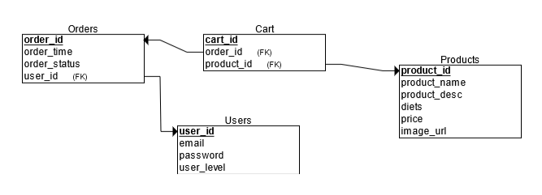

# Elysium Database

## Required tables for the database

- products

  - product id (PK)
  - food name (string)
  - description (string)
  - special diets (string)
  - prices (float)

- user

  - id (PK)
  - login info (email?)
  - encrypted password
  - user level

- order table
  - order id (PK)
  - timestamp
  - product id (FK)
  - user id (FK)
  - order status (active/completed/cancelled)

### Diagram for the database

